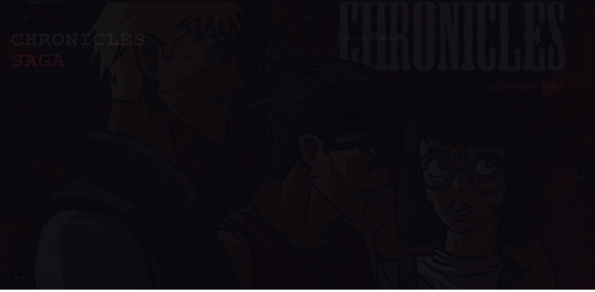

# Chronicles Saga

A story-driven, choice-based interactive narrative game built with React + Vite. Players uncover a branching cyberpunk thriller by navigating a simulated phone, desktop computer, and desk environment — reading texts, emails, files, and terminal output as the story unfolds.

---

## What It Is

Chronicles Saga puts you in the role of a "viewer" — one of four selectable characters — observing and influencing events through a fully simulated digital environment. The story plays out across SMS threads, email inboxes, a file browser, and a terminal, all driven by a JSON-based narrative engine that responds to your choices.

Every decision you make affects **trust scores** with characters and shifts your **alignment** across three philosophical axes, leading to different outcomes as the story branches.

---

## Screenshots





---

## Tech Stack

- **React 19** — UI and component rendering
- **Vite 8** — dev server and production builds
- **Plain JavaScript (JSX)** — no TypeScript
- **CSS / Inline Styles** — custom cyberpunk theme with CSS variables
- **No external UI libraries** — fully custom components

---

## Getting Started

### Prerequisites

- [Node.js](https://nodejs.org/) v18 or higher
- npm (comes with Node)

### Installation

```bash
git clone https://github.com/Arinzayyy/Chronicles-Saga.git
cd Chronicles-Saga
npm install
npm run dev
```

Then open your browser to `http://localhost:5173`.

---

## Available Scripts

| Command | Description |
|---|---|
| `npm run dev` | Start development server with hot reload |
| `npm run build` | Build for production (outputs to `dist/`) |
| `npm run preview` | Preview the production build locally |
| `npm run lint` | Run ESLint across all files |

---

## Project Structure

```
chronicles-saga/
├── src/
│   ├── assets/              # Images, audio, character portraits
│   ├── data/
│   │   └── story.json       # All narrative content (beats, choices, directives)
│   ├── context/
│   │   ├── GameContext.jsx  # Global game state (trust, alignment, messages)
│   │   └── EngineContext.jsx
│   ├── engine/
│   │   └── engine.js        # Beat sequencer and directive executor
│   ├── screens/             # All UI screens (13 total)
│   │   ├── MainMenu.jsx
│   │   ├── Prologue.jsx
│   │   ├── CharacterSelect.jsx
│   │   ├── DeskScene.jsx    # Central hub
│   │   ├── PhoneShell.jsx
│   │   ├── PhoneHome.jsx
│   │   ├── SMSApp.jsx
│   │   ├── GalleryApp.jsx
│   │   ├── SettingsApp.jsx
│   │   ├── ComputerHome.jsx
│   │   ├── EmailApp.jsx
│   │   ├── FilesApp.jsx
│   │   └── Terminal.jsx
│   ├── utils/
│   │   └── sound.js         # Click SFX handler
│   ├── App.jsx              # Main router + BGM manager
│   └── main.jsx             # React entry point
├── public/
├── index.html
├── vite.config.js
└── package.json
```

---

## How It Works

### Narrative Engine

The story is entirely data-driven. `src/data/story.json` defines chapters made up of **beats** — each beat is a sequence of **directives** (e.g. `send_text`, `typing_indicator`, `unlock_app`, `pause`) that the engine executes with realistic timing to simulate a live conversation.

Beats can end with **player choices** (which branch the story and affect trust/alignment) or auto-advance via `on_complete`.

### Game State

`GameContext.jsx` manages all live state including:

- **Trust scores** per character (0–100): hostile → cold → neutral → warm → allied
- **Alignment axes** (−100 to +100): Integration, Dominion, Calibration
- **Message threads**, emails, unlocked apps, and story flags

### Environments

The game takes place across three simulated contexts, each accessible from the desk:

- **Phone** — SMS threads, photo gallery, settings
- **Computer** — Email inbox, file browser, terminal
- **Desk** — The central hub; click the monitor or phone to switch contexts

---

## Adding / Editing Story Content

All narrative content lives in `src/data/story.json`. You can add chapters, beats, characters, and choices without touching any component code. The engine reads the JSON at runtime and handles sequencing automatically.

---

## Contributing

1. Fork the repo
2. Create a feature branch: `git checkout -b feature/your-feature`
3. Commit your changes: `git commit -m "describe your change"`
4. Push to your branch: `git push origin feature/your-feature`
5. Open a pull request

---

## Author

**Arinze Ohaemesi**
- GitHub: [@Arinzayyy](https://github.com/Arinzayyy)
- LinkedIn: [arinze-ohaemesi](https://www.linkedin.com/in/arinze-ohaemesi-1667a426b/)
